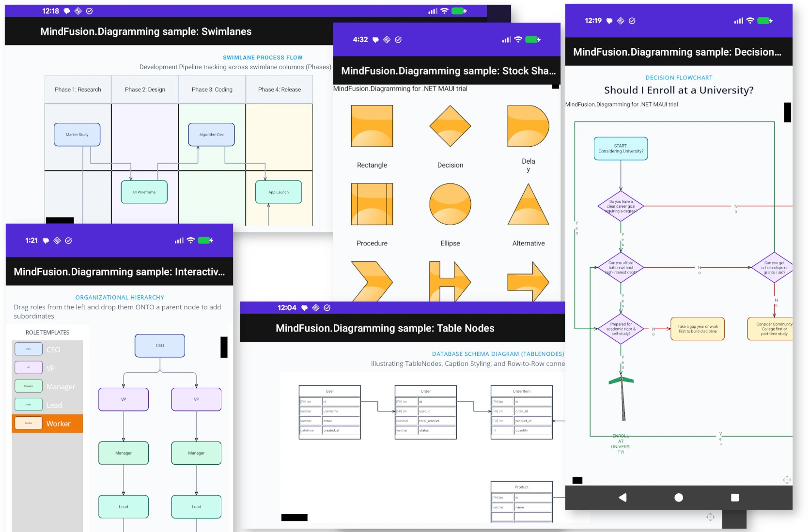

# MindFusion Diagramming Samples for .NET MAUI 

Welcome to the ultimate repository for high-performance, cross-platform interactive diagramming in **.NET MAUI**, powered by the industry-leading **MindFusion.Diagramming** library. 

This repository contains a curated collection of production-ready, beautifully designed samples designed for modern (.NET 9/10) mobile and desktop platforms. Each sample emphasizes clean, modern, flat vector aesthetics, optimized layouts, and intuitive touch/pointer interactions.




---

## Highlighted Samples

### 1. Interactive Org Chart Builder (`HierarchyTree`)
An advanced organizational chart editor showing a 2-column workspace:
* **Drag-and-Drop Templates:** Drag role templates (CEO, VP, Manager, etc.) from a left-hand `NodeListView` and drop them directly onto existing diagram nodes.
* **Intelligent Drop Snapping:** Dropping onto a parent node creates a hierarchy link and automatically re-balances, centers, and aligns the tree using the **`TreeLayout`** algorithm. Dropping on empty space is safely canceled.
* **Centered Typography:** Text is perfectly centered horizontally and vertically inside uniform, modern rounded cards.

### 2. Horizontal Process Swimlanes (`LaneDiagram`)
A landscape-oriented process timeline and development pipeline tracking tasks across different phases and teams:
* **Distinct Lane Groupings:** Features **4 Phase Column Lanes** colored in distinct soft pastel tints (Slate, Lavender, Mint, Amber) and **3 Team Row Lanes** (Core, UI, Cloud).
* **Automated Cell Snapping:** Whenever task cards are added or dragged, they automatically snap perfectly centered inside the cells with balanced inner spacing.
* **Horizontal Cascade Routing:** Links follow a horizontal cascading structure, keeping timelines tidy and easily readable.

### 3. Modern Decision Flowchart (`DecisionFlowchart`)
A clean, visual flowchart solving the classic question: *"Should I enroll at a university?"*
* **Automated `DecisionLayout`:** Eliminates hardcoded coordinates by using a specialized semantic decision-flow layout that automatically routes conditional links and displays "Yes"/"No" branches.
* **Sleek 2026 Graphics:** Leverages micro-shadows, modern flat pastel colors, and an embedded custom image loaded onto a transparent node representing the final positive outcome.
* **Static App Header:** Moves title rendering to a native MAUI stack layout, keeping the header sharp at the top while the diagram remains fully zoomable.

### 4. Database Schema UML Diagram (`TableNodes`)
An illustrative e-commerce database entity-relationship (ER) diagram showcasing **`TableNode`** capabilities:
* **Tabular Attribute Modeling:** Represents tables (`User`, `Order`, `OrderItem`, `Product`) using structured rows and columns.
* **Row-to-Row Relations:** Explicitly links a specific attribute in one table to its primary/foreign key counterpart in another table using `OriginIndex` and `DestinationIndex` properties.
* **Flat Database Styling:** Features high-contrast access modifiers, bold field names, and soft Slate header fills.

---

## 📂 Repository Directory Structure

```bash
InstallFolder
├── README.md               # Sibling repository overview and documentation
└── Samples/
    ├── HierarchyTree/      # Interactive org tree with drag-and-drop & TreeLayout
    ├── LaneDiagram/        # Landscape process timelines with cell-snapping & swimlanes
    ├── DecisionFlowchart/  # Flowcharts using DecisionLayout & custom node images
    ├── TableNodes/         # ER Database schema with Row-to-Row relationship links
    # Standard auxiliary samples
    ├── AnchorPoints/       # Linking customization & connection anchor patterns
    ├── NodeList/           # Drag-and-drop templates baseline
    ├── RadialMenu/         # Interactive canvas overlay commands
    ├── StockShapes/        # Predefined MindFusion vector shapes
    └── ...
```

---

## 🛠️ Getting Started & How to Run

### Prerequisites
* **.NET SDK:** .NET 9.0 or .NET 10.0 SDK installed.
* **MAUI Workload:** Install via command line:
  ```bash
  dotnet workload install maui
  ```
* **IDEs:** Visual Studio 2022 (with MAUI workload enabled) or VS Code with C# Dev Kit.

### Quick Build & Compilation (Windows / CLI)
To compile and restore any of the samples, navigate to the sample directory and run the standard build command. For example, to build the `HierarchyTree` sample:

```bash
cd Samples/HierarchyTree
dotnet build HierarchyTree.csproj -f net10.0-windows10.0.19041.0
```

To run the sample:
```bash
dotnet run -f net10.0-windows10.0.19041.0
```

*(You can substitute the framework moniker for `-f net10.0-android`, `-f net10.0-ios`, or `-f net10.0-maccatalyst` depending on your deployment target).*

---

## Visual Design Guidelines Sourced

* **Zero-Glass Aesthetic:** All 2026-targeted samples discard heavy glossy effects in favor of flat vector geometry, balanced stroke scales (`0.4`), and light micro-shadows (`#15172A` at `6-10%` opacity).
* **Accessible Sizing:** Custom labels and item text use the native .NET MAUI font engine via `Microsoft.Maui.Font.OfSize("FamilyName", Size)` to preserve crisp typography on high-density Retina/Android screens.

---

## Technical Support
Feel free to open issues or pull requests to add new diagramming shapes, custom layout constraints, or platform-specific performance optimizations! For official MindFusion technical support, visit the [MindFusion Forums](https://mindfusion.dev/Forum/YaBB.pl), check the [Online Documentation](https://mindfusion.dev/docs/maui/diagramming/Introduction_4.htm). You can visit the [official .NET MAUI Diagram product page](https://mindfusion.dev/maui-diagram.html) to learn more about the component and its features.

---
*Created with ❤️ using .NET MAUI and MindFusion.Diagramming.*
